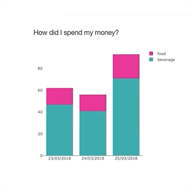
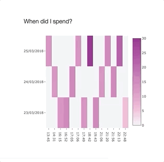
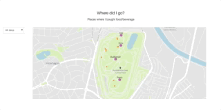
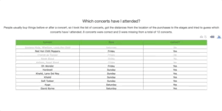

# 🎟Using Plotly to visualize data

This project uses Plotly to build interactive charts for the web using Pyhton.

## Motivation
D3.js is an awesome Javascript library but often times our goal is just to build a visualization with some well-known charts.
Plotly is a great tool for that

## Charts
### Stacked bar chart

### Heatmap

### Map

### Table

## How to use?
Run `python3 name_of_the_chart.py`
